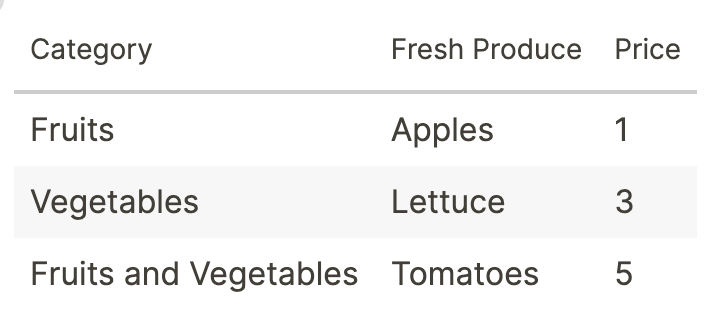
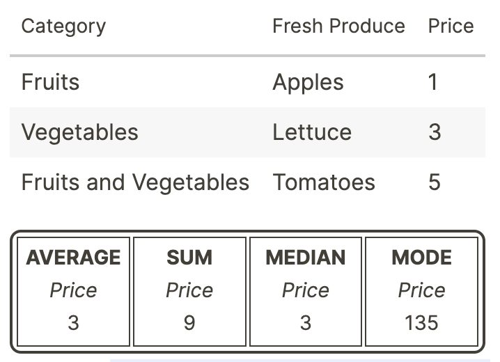
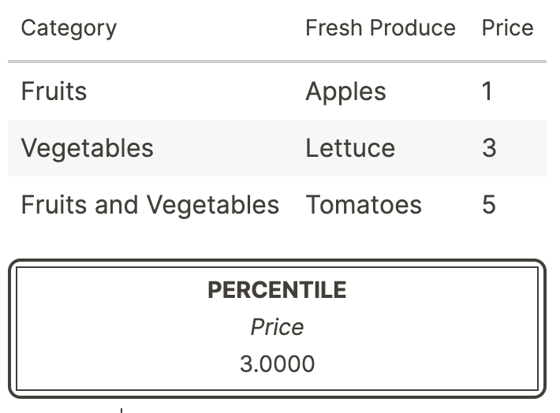

[:gift_heart: Sponsor this project on Github](https://github.com/sponsors/hkgnp) or [:coffee: Get me a coffee](https://www.buymeacoffee.com/hkgnp.dev) if you like this plugin!

# Overview

Render tables with basic math functions using data from your blocks. Just use the slash command `/Render table` to get started!

# Instructions

## Basic table


To draw a table above, you can use any one of the below approaches, with the flags `data`, `rows` or `cols`.

1) `data`
```md
- data
    - Category
        - Fruits
        - Vegetables
        - Fruits and Vegetables
    - Fresh Produce
        - Apples
        - Lettuce
        - Tomatoes
    - Price
        - 1
        - 3
        - 5
```

2) `rows` 
```md
- rows
	- Category
		- Fresh Produce
			- Price
	- Fruits
		- Apples
			- 1
	- Vegetables
		- Lettuce
			- 3
	- Fruits and Vegetables
		- Tomatoes
			- 5
```

3) `cols` 
```md
- cols
	- Category
		- Fresh Produce
		- Price
	- Fruits
		- Apples
		- 1
	- Vegetables
		- Lettuce
		- 3
	- Fruits and Vegetables
		- Tomatoes'
		- 5
```

## Table with basic stats

The following basic statistical calculations are available:
- Sum (sum)
- Average (average)
- Median (median)
- Mode (mode)
- Variance (variance)
- Standard Deviation (sd)
- Sample Standard Deviation (ssd)
- Percentile (percentile)*

To use any of the above, use its shortcut (in brackets above) with the columns that you would like to compute (`<shortcut>-<column>`).

### Example

1) `sum-3 average-3 median-3 mode-3` will render:


2) *Percentile requires an additional flag to indicate the perecntile that you would like to compute. `percentile-3-50` will compute the 50th percentile of the 3rd column.


# Installation

Look for `logseq-tablerender-plugin` in the marketplace and install from there.

# Credits

[stats-lite](https://github.com/brycebaril/node-stats-lite) for providing the calculations. 